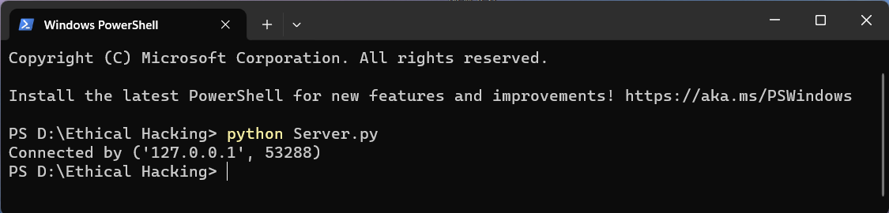
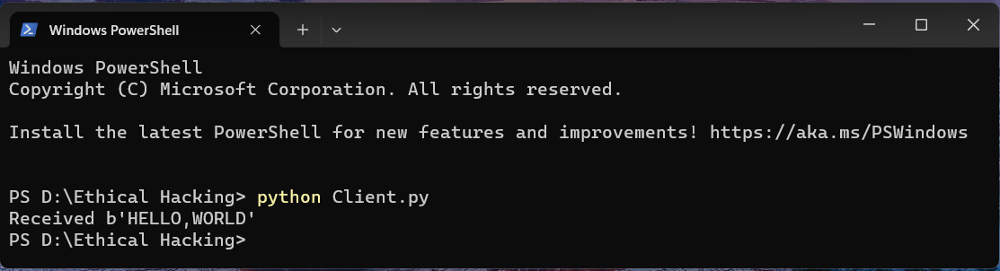

# Echoserver
Echo server and client using python socket
```
Name: Hariharan M
Reg.No: 212221230034
```
## AIM:
To develop a simple webserver to serve html programming pages.

## DESIGN STEPS:
### Step 1:
Design of echo server and client using python socket
### Step 2:
Implementation using Python code
### Step 3:
Testing the server and client 

## PROGRAM:
### Server.py
```
import socket
host="127.0.0.1"
port=65432

with socket.socket(socket.AF_INET,socket.SOCK_STREAM) as s:
    s.bind((host,port))
    s.listen()
    conn,addr=s.accept()
    with conn:
        print(f"Connected by {addr}")
        while True:
            data=conn.recv(1024)
            if not data:
                break
            conn.sendall(data)
```

### Client.py
```
import socket
host="127.0.0.1"
port=65432
with socket.socket(socket.AF_INET, socket.SOCK_STREAM) as s:
    s.connect((host,port))
    s.sendall(b"HELLO,WORLD")
    data=s.recv(1024)
print(f"Received {data!r}")
```
## OUTPUT:



## RESULT:
Thus the program is executed successfully.
